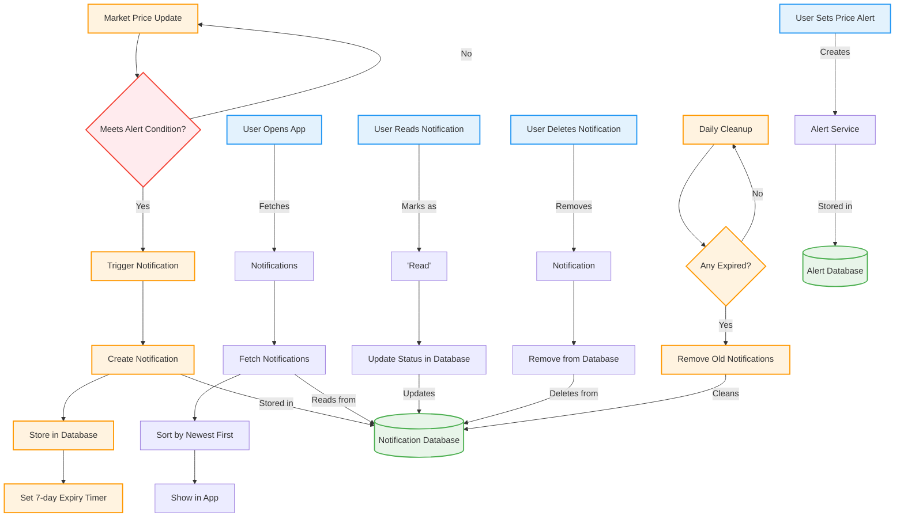

# Trading Notification API
## Overview
The Trading Notification API is a production-ready system delivering real-time cryptocurrency price alerts through a layered microservices architecture. The notification subsystem implements advanced patterns including circuit breakers, Redis pipelines, and asynchronous processing for reliable operation.
## System Architecture
```
Client Requests → API Gateway (FastAPI) → Redis Storage
                          ↑
Background Dispatcher ↔ Binance WebSocket
```
### Notification Flow

## Notification Management Features
### Real-time Processing Pipeline
1. **Price Ingestion**: WebSocket connection to Binance with automatic reconnection
2. **Condition Evaluation**: Continuous comparison against alert thresholds
3. **Atomic Triggering**:
   - Redis pipeline transactions prevent race conditions
   - Prevents duplicate notifications for same event
4. **Stateful Notifications**:
   - Automatic status tracking (read/unread)
   - Timestamped creation with TTL expiration
### State Management
- **Status Tracking**: `UNREAD` → `READ` transitions via atomic Redis updates
- **Retention Policy**: Automatic cleanup after 7 days via Redis TTL
- **Alert Association**: Notifications maintain reference to source alert
### Reliability Features
- **Circuit Breaker Pattern**:
  - Closed: Normal operation
  - Open: Blocks requests during failures
  - Half-Open: Test recovery
- **Exponential Backoff**: Progressive delays for WebSocket reconnections
- **Health Monitoring**: Tracking of delivery success/failure rates
## API Endpoints
### Notification Management
| Endpoint | Method | Description | Parameters | Status Codes |
|----------|--------|-------------|------------|--------------|
| `/api/v1/notifications` | GET | Retrieves user notifications | - | 200, 401, 503 |
| `/api/v1/notifications/{nid}/read` | PATCH | Marks notification as read | `nid`: Notification ID | 200, 404, 401 |
| `/api/v1/notifications/{nid}` | DELETE | Deletes specific notification | `nid`: Notification ID | 204, 404, 401 |
### Alert Management (Notification Sources)
| Endpoint | Method | Description | Parameters | Status Codes |
|----------|--------|-------------|------------|--------------|
| `/api/v1/alerts` | POST | Creates new price alert | `symbol`, `type`, `price` | 201, 401, 422 |
| `/api/v1/alerts` | GET | Retrieves active alerts | - | 200, 401, 503 |
| `/api/v1/alerts/{alert_id}` | DELETE | Deletes specific alert | `alert_id`: Alert ID | 204, 404, 401 |
### System Health
| Endpoint | Method | Description | Response Fields |
|----------|--------|-------------|-----------------|
| `/api/v1/health` | GET | Monitoring endpoint | `redis`, `monitoring`, `circuit`, `uptime_s`, `version` |

## Production Features
- **Atomic Operations**: Redis pipelines ensure consistent state changes
- **Automatic Cleanup**: TTL-based expiration of stale notifications
- **Graceful Degradation**: Circuit breaker prevents cascading failures
- **Structured Logging**: Operational visibility for debugging
- **Connection Pooling**: Efficient Redis resource management
- **Configurable Buffers**: Prevents notification spamming (±0.5 USD default)
